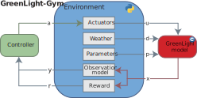

# GreenLight-Gym 2.0

## Reinforcement learning benchmark environment for control of greenhouse production systems 

<p align="center">
  
</p>


## Summary

**This repository is a reimplementation of the high-tech greenhouse model [GreenLight](https://github.com/davkat1/GreenLight) with `CasADi` in `C++` with bindings for `Python`. The environment is designed to train reinforcement learning models to control greenhouse crop production systems.**

The code in this repository was used for the following [preprint](https://arxiv.org/abs/2410.05336) that has been accepted by [The 8th IFAC Conference on 
Sensing, Control and Automation Technologies for Agriculture](https://agricontrol25.sf.ucdavis.edu/).

✏ author: Bart van Laatum

📧 e-mail: bart.vanlaatum@wur.nl

## Installation

**Prerequisites**

Before installing and using the repository, make sure your system has the following:

- **Weights & Biases Account:**  
  A free account on [Weights & Biases](https://wandb.ai) is required to track experiments when using the provided RL scripts.

- **C++ Compiler:**  
  A C++ compiler that supports C++17 (for example, GCC 7 or later, or Clang 6 or later).


- **CasADi Library:**  
  Install the [CasADi](https://web.casadi.org/) library. This work builds on CasADi version 3.6.7. Linux machines can build CasADi from the source using these instructions:

  #### 1. Clone the repo and checkout v3.6.7
  ```shell
  git clone https://github.com/casadi/casadi.git  
  cd casadi
  git checkout a2d71bf # switch to the commit linked to v3.6.7
  ```

  #### 2. Create a build directory
  ```shell
  mkdir build && cd build
  ```

  #### 3. Configure with CMake; 
  ```shell
  # make sure to install casadi in `/usr/local` since setup.py searches for that path when binding the C++ script with Python.
  cmake .. \
  -DCMAKE_BUILD_TYPE=Release \
  -DCMAKE_INSTALL_PREFIX=/usr/local
  ```

  #### 4. Build & install
  ```shell
  make -j$(nproc)
  sudo make install
  ```
  
  #### 5. Refresh the linker cache
  ```shell
  sudo ldconfig
  ```

  This installs:

  - Headers into /usr/local/include/casadi
  - Shared library libcasadi.so* into /usr/local/lib

  > NOTE: Windows and macOS users installing CasADi is a bit more tricky. For Windows your best shot is using [`vcpkg`](https://vcpkg.io/en/). Please let me know whether you succeed the installation, such that we can add it to this installation guide.
___

1. **Clone the repository**
    ```shell
    git clone https://github.com/BartvLaatum/GreenLight-Gym2.git
    cd GreenLight-Gym
    ```

2. **Setup a Python virtual environment**

    For instance, using anaconda:

    ```shell
    conda create -n greenlight_gym python==3.11
    conda activate greenlight_gym
    ```

3. **Install the repository in Editable Mode**

   This repository is set up for an editable install using pip. From the root directory run:

   ```shell
   pip install -e .
   ```

   This command uses the setup.py file to build the C++ module (with dynamic paths) and install all Python packages. Adjust paths in `setup.py` if your libraries (like CasADi) are installed in different locations.

## Repository Structure

- The `gl_gym/` folder contains:
    - Environment code under [`environments`](./gl_gym/environments) (models, dynamics, parameters, and utility functions).
    - Configuration files under [`configs`](./gl_gym/configs).
    - Common utility functions under [`common`](./gl_gym/common).
    - The [`experiments/`](./gl_gym/experiments) folder contains: Experiment scripts (e.g. RL training or evaluation – see `gl_gym/experiments/rl.sh`). 
    - The [`RL/`](./gl_gym/RL) folder contains, the experiment manager (experiment_manager.py) that sets up training, evaluation, hyperparameter tuning (using Weights & Biases), etc.

## Usage

1. **Running an RL Experiment**

To start a new reinforcement learning experiment using (for example) PPO on the Tomato environment, run:

```shell
python gl_gym/RL/experiment_manager.py --env_id TomatoEnv --algorithm ppo
```

> NOTE: The environment uses CasADi's code generation function to speed up the execution time. This generates $N$ `*.c`, `*.o` and `*.so` files. Unfortunately, these are not automatically deleted after training.

2. **Evaluation of Trained Models**
You can evaluate pre-trained models using the evaluation scripts provided in the experiments folder `evaluate_rl.py`:

```shell
python gl_gym/experiments/evaluate_rl.py --project PROJECT_NAME --env_id TomatoEnv --model_name YOUR_MODEL_NAME --algorithm ppo
```

3. **Visualizations**
    - **Plotting**: The repository includes scripts under [visualisations](./visualisations/) for plotting learning curves and cost metrics
__
### Notes

Adjust paths in `setup.py` if your libraries (like `CasADi`) are installed in different locations. The repository is designed as a reinforcement learning environment for greenhouse crop production. The environment ([TomatoEnv](./gl_gym/environments/tomato_env.py)) and the RL algorithms configurable via the config files in envs.

## Future

We plan to extend GreenLight-Gym with the following features:

- **Python-native Model Implementation:**  
  Develop a pure Python version of the greenhouse model for easier maintenance, faster prototyping, and broader accessibility.

- **Model Predictive Control (MPC):**  
  Integrate MPC as an additional control baseline to benchmark against reinforcement learning algorithms.

- **Additional Crop Models:**  
  Add support for more crop types (e.g., cucumber, lettuce) to enable multi-crop benchmarking and research.

- **Adding more realistic energy systems:**  
  Precisely model the greenhouse energy consumption for heating, cooling, ventilation and lighting, via [EnergyPlus](https://energyplus.net/).

- **Improved Visualization Tools:**  
  Enhance the visualization suite for better analysis of experiments and model performance.


## Citation

If you find this repository and/or its accompanying article usefull, please cite it in your publications

```bibtex
@misc{vanlaatum2025greenlightgymreinforcementlearningbenchmark,
      title={GreenLight-Gym: Reinforcement learning benchmark environment for control of greenhouse production systems}, 
      author={Bart van Laatum and Eldert J. van Henten and Sjoerd Boersma},
      year={2025},
      eprint={2410.05336},
      archivePrefix={arXiv},
      primaryClass={eess.SY},
      url={https://arxiv.org/abs/2410.05336}, 
}
```
