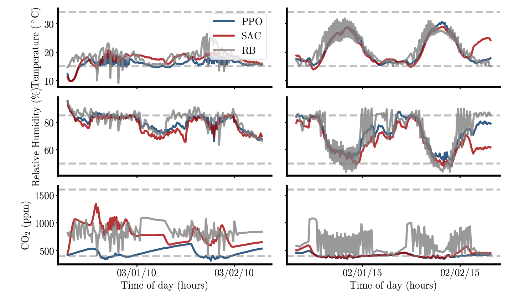
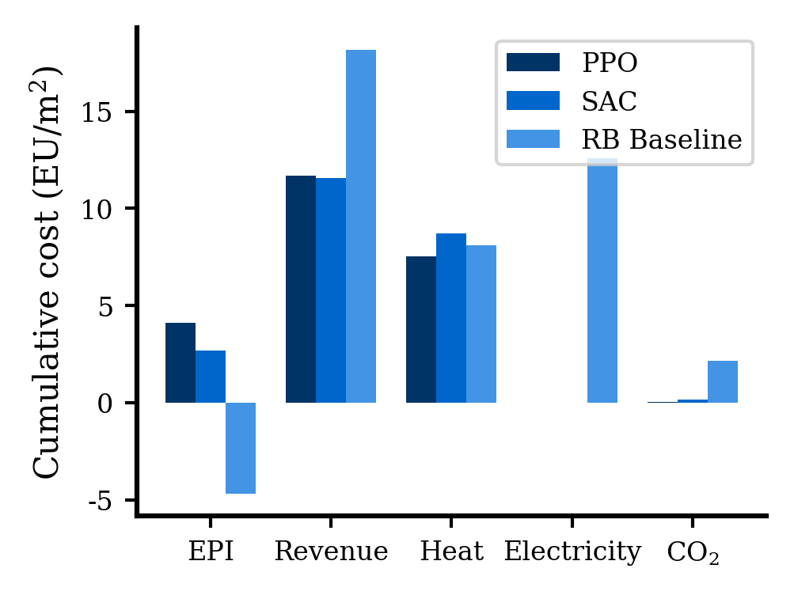
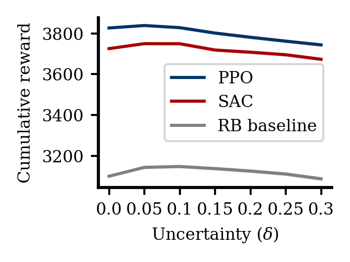

# GreenLight-Gym 2.0

## Reinforcement learning benchmark environment for control of greenhouse production systems 

<p align="center">
  
</p>


## Summary

GreenLight-Gym is a benchmark simulation environment for **training and evaluating reinforcement learning (RL) controllers** in high-tech greenhouse crop production systems.

It is based on the validated high-tech greenhouse model [GreenLight](https://github.com/davkat1/GreenLight), and provides:

- Realistic greenhouse climate and crop dynamics for RL research.
- Implementation in the automatic differentiation tool CasADi for increased simulation speeds.
- Baseline rule-based controllers for benchmarking.
- Configurable experiments with reproducible setups.
- Visualizations tolls for analysis.

<!-- The code in this repository was used for the following [preprint](https://arxiv.org/abs/2410.05336) that has been accepted by [The 8th IFAC Conference on 
Sensing, Control and Automation Technologies for Agriculture](https://agricontrol25.sf.ucdavis.edu/). -->

This repository was used in the following accepted conference paper:

📄 [Preprint](https://arxiv.org/abs/2410.05336): [The 8th IFAC Conference on Sensing, Control and Automation Technologies for Agriculture](https://agricontrol25.sf.ucdavis.edu/)

✏ Author: Bart van Laatum

📧 E-mail: bart.vanlaatum@wur.nl

### 📣 What’s New in v0.2

v0.2 marks a shift from the v0.1 C++ build to a pure Python-native model:

> - [x] No C++ build that only works for Ubuntu.
> - [x] Easy installation for operating systems Windows, Linux, and maxOS via `pip install -e .`
>
> 🔗 For the C++ version of the GreenLight models, use **v0.1** release tag and its README.

## Installation

### Requirements
- Python >= 3.10 (tested on 3.11).
- Recommended: `conda` or `venv` for environment management.

1. **Clone the repository**
    ```shell
    git clone https://github.com/BartvLaatum/GreenLight-Gym2.git
    cd GreenLight-Gym2
    ```

2. **Setup a Python virtual environment**

    For instance, using anaconda (or `python -m venv`)

    ```shell
    conda create -n greenlight_gym python==3.11
    conda activate greenlight_gym
    ```

3. **Install the repository in Editable Mode**

   This repository is set up for an editable install using pip. From the root directory run:

   ```shell
   pip install -e .
   ```

## Repository Structure

| Folder                 | Description                                                      |
| ---------------------- | ---------------------------------------------------------------- |
| `gl_gym/environments/` | Environment definitions: models, parameters, rewards, observations|
| `gl_gym/configs/`      | YAML configuration files for agents and environments             |
| `gl_gym/common/`       | Shared utility functions                                         |
| `gl_gym/RL/`           | Experiment manager, training setup, W\&B integration             |
| `gl_gym/experiments/`  | Python experiment scripts (training, evaluation)                 |
| `run_scripts/`         | Bash wrappers for experiment scripts                             |
| `visualisations/`      | Plotting and analysis scripts                                    |

## Usage

1. **Running an RL Experiment**

To start a new reinforcement learning experiment, users can either directly run a Python script or run a bash script in [`run_scripts/`](./run_scripts/) that calls a Python script. The environment, model, etc. can be changed via flags in the command line arguments.

The following command trains the PPO agent on the TomatoEnv environment, saves the best and the last model, and accompanying environment normalization statistics. The hyperparameter tuning flag is optional. One can adjust hyperparameter tuning settings in the files in [`sweeps/`](./gl_gym/configs/sweeps/).

```bash
  python gl_gym/RL/experiment_manager.py
      --project PROJECT_NAME
      --env_id TomatoEnv
      --algorithm ppo
      --group ppo_det
      --n_eval_episodes 1
      --n_evals 10
      --env_seed 666
      --model_seed 666
      --device cpu
      --save_model
      --save_env
      # --hyperparameter_tuning
```

The bash script equivalent:

```bash
bash run_scripts/rl.sh
```

> Note: This run will initialze a Weights and Biases run. Users are queried to either login to their account, create an account or continue without visualizations and model logging.

2. **Evaluation of Trained Models**
You can evaluate trained models using the evaluation scripts provided in the experiments folder `evaluate_rl.py`:

```shell
python gl_gym/experiments/evaluate_rl.py --project PROJECT_NAME --env_id TomatoEnv --model_name YOUR_MODEL_NAME --algorithm ppo
```

3. **Evaluation of Baseline Controller**
You can evaluate the rule-based baseline controller for different levels of parametric uncertainty through the following bash script:

```bash
bash run_scripts/eval_baseline.sh
```

> Note that this is called through a bash script. Windows users should execute a bash script via Git bash.

4. **Visualizations**
    - **Plotting**: The repository includes scripts under [visualisations](./visualisations/) for plotting learning curves and cost metrics. 
    - Before, generating any plots you must have evaluated your RL agents with `evaluate_rl.py` and a rule-based baseline with `evaluate_baseline.py`


    #### Time-series of trajectories.
    Compares the state and control input trajectories for $N$ consecutive days.
    ```shell
    python visualisations/trajectories.py --project PROJECT_NAME --MODE --ppo_name PPO_MODEL_NAME --sac_name SAC_MODEL_NAME --growth_year GROWTH_YEAR --start_day START_DAY --location LOCATION --n_days2plot NUMBER_OF_DAY_TO_VISUALIZE --uncertainty_value UNCERTAINTY_VALUE
    ```    
    <p align="center">
      
    </p>

    #### Bar plot the performance metrics.
    Creates a bar plot of controller performance regarding cost en constraints metrics.
    ```shell
    python visualisations/cost_metrics.py --project PROJECT_NAME --MODE --uncertainty_value UNCERTAINTY_VALUE --growth_year GROWTH_YEAR --start_day START_DAY --location LOCATION
    ```
    #### Example of comparing SAC, PPO and rule-based agent (RB) on economic performance indicator (EPI) metrics.
    <p align="center">
      
    </p>

    #### Line plot the performance metrics over parametric uncertainty scale.
    Visualizes how the cumulative reward changes with different levels of parametric uncertainty in the environment by comparing controller performance. NOTE: Don't forget to update variable `model_names` to the correct model names in [`param_uncertainty.py`](./visualisations/param_uncertainty.py). 
    ```shell
    python visualisations/param_uncertainty.py --project PROJECT_NAME --mode MODE --growth_year GROWTH_YEAR --start_day START_DAY --location LOCATION
    ```
      #### Example of comparing SAC, PPO and rule-based agent (RB) on the cumulative reward trained per parametric uncertainty environment.
    <p align="center">
      
    </p>

> Note that the other three scripts in `visualisations/` require additional data, which can be made available upon request.

## Future road map

We plan to extend GreenLight-Gym with the following features:

- [x] ~~**Python-native Model Implementation:**~~
  Develop a pure Python version of the greenhouse model for easier maintenance, faster prototyping, and broader accessibility. *(Implemented in v0.2)*

- **Model Predictive Control (MPC):**  
  Integrate MPC as an additional control baseline to benchmark against reinforcement learning algorithms.

- **Additional Crop Models:**  
  Add support for more crop types (e.g., cucumber, lettuce) to enable multi-crop benchmarking and research.

- **Adding more realistic energy systems:**  
  Precisely model the greenhouse energy consumption for heating, cooling, ventilation and lighting, via [EnergyPlus](https://energyplus.net/).

- **Improved Visualization Tools:**  
  Enhance the visualization suite for better analysis of experiments and model performance.


## Citation

If you find this repository and/or its accompanying article usefull, please cite it in your publications.

```bibtex
@misc{vanlaatum2025greenlightgymreinforcementlearningbenchmark,
      title={GreenLight-Gym: Reinforcement learning benchmark environment for control of greenhouse production systems}, 
      author={Bart van Laatum and Eldert J. van Henten and Sjoerd Boersma},
      year={2025},
      eprint={2410.05336},
      archivePrefix={arXiv},
      primaryClass={eess.SY},
      url={https://arxiv.org/abs/2410.05336}, 
}
```
