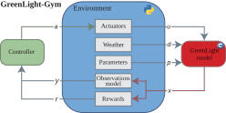

# GL-Gym

**Gymnasium environment for reinforcement learning control of greenhouse tomato crop production using the GreenLight model.**

<p align="center">
  
</p>

GL-Gym provides a [Gymnasium](https://gymnasium.farama.org/)-compatible environment that simulates a high-tech greenhouse growing tomatoes.
An RL agent controls heating, CO2 dosing, ventilation, thermal and blackout screens, and supplemental lighting to maximise crop profit while respecting indoor climate constraints.

The underlying crop-climate model is the validated [GreenLight](https://github.com/davkat1/GreenLight) greenhouse model, implemented in [CasADi](https://web.casadi.org/) for fast numerical integration.

| Public env\_id | Task |
|---|---|
| `gl_gym/GreenLightTomato-v0` | 60-day greenhouse tomato production control with profit-based reward and indoor climate penalties |

---

## Table of Contents

- [Installation](#installation)
- [Quick Start](#quick-start)
- [Public Environment: GreenLightTomato-v0](#public-environment-greenlighttomato-v0)
- [Observation Space](#observation-space)
- [Action Space](#action-space)
- [Reward Function](#reward-function)
- [Custom Rewards](#custom-rewards)
- [Custom Observation Modules](#custom-observation-modules)
- [Parameter Sampling and Domain Randomization](#parameter-sampling-and-domain-randomization)
- [Weather Sampling](#weather-sampling)
- [Using Custom Weather Data](#using-custom-weather-data)
- [Weather Data Format](#weather-data-format)
- [Evaluation Reproducibility](#evaluation-reproducibility)
- [Development and Extensibility](#development-and-extensibility)
- [Citation](#citation)

---

## Installation

### Requirements

- Python >= 3.11
- Recommended: `conda` or `venv` for environment management.

### Install from source

```bash
git clone https://github.com/BartvLaatum/GreenLight-Gym2.git
cd GreenLight-Gym2
pip install -e .
```

This installs `gl_gym` in editable mode with the core dependencies needed to run the environment.

### Install with training dependencies

To also install [Stable-Baselines3](https://stable-baselines3.readthedocs.io/), PyTorch, W&B, and other training utilities:

```bash
pip install -e ".[train]"
```

---

## Quick Start

### Create the environment

```python
import gymnasium as gym
import gl_gym  # registers gl_gym/GreenLightTomato-v0

env = gym.make("gl_gym/GreenLightTomato-v0")
obs, info = env.reset(seed=42)
```

### Run a random-action loop

```python
import gymnasium as gym
import gl_gym

env = gym.make("gl_gym/GreenLightTomato-v0")
obs, info = env.reset(seed=0)

for _ in range(100):
    action = env.action_space.sample()
    obs, reward, terminated, truncated, info = env.step(action)
    if terminated or truncated:
        obs, info = env.reset()

env.close()
```

### Flatten Dict observations for RL libraries

The raw observation space is a `gymnasium.spaces.Dict`. Most RL libraries (Stable-Baselines3, CleanRL, etc.) expect a flat `Box` space.
Wrap the environment with `FlattenObservation`:

```python
import gymnasium as gym
from gymnasium.wrappers import FlattenObservation
import gl_gym

env = gym.make("gl_gym/GreenLightTomato-v0")
env = FlattenObservation(env)

obs, info = env.reset(seed=0)
print(obs.shape)  # flat numpy array
```

### Train with Stable-Baselines3

```python
import gymnasium as gym
from gymnasium.wrappers import FlattenObservation
from stable_baselines3 import PPO
import gl_gym

env = gym.make("gl_gym/GreenLightTomato-v0")
env = FlattenObservation(env)

model = PPO("MlpPolicy", env, verbose=1)
model.learn(total_timesteps=50_000)
```

---

## Public Environment: GreenLightTomato-v0

| Property | Value |
|---|---|
| **env\_id** | `gl_gym/GreenLightTomato-v0` |
| **Season length** | 60 days |
| **Solver timestep** | 900 s (15 min) |
| **Steps per episode** | 5760 |
| **Reward** | Profit-based: fruit revenue minus operating costs, with indoor climate violation penalties |
| **Observation space** | `Dict` with 5 modules (22 values total) |
| **Action space** | `Box(-1, 1, shape=(6,))` (normalized) |
| **Default weather** | Amsterdam, year 2010, start day 59 |

The default registration parameters match the configuration in `gl_gym/configs/envs/GreenLightEnv.yml`.
Any keyword argument accepted by `GreenLightEnv` can be overridden in `gymnasium.make()`:

```python
env = gym.make(
    "gl_gym/GreenLightTomato-v0",
    season_length=90,
    weather_scenario_sampler="random",
    weather_scenario_sampler_kwargs={
        "locations": ["Amsterdam", "London"],
        "growth_years": [2015, 2016, 2017],
        "start_days": range(1, 120),
    },
)
```

---

## Observation Space

The observation space is a `gymnasium.spaces.Dict` assembled from independent **observation modules**.
Each module defines a named sub-space and computes its slice of the observation.

### Default modules

| Module | Key | Shape | Description |
|---|---|---|---|
| `BasicCropObservations` | `BasicCropObservations` | (3,) | 24h canopy temperature, fruit dry weight, temperature sum |
| `ControlObservations` | `ControlObservations` | (6,) | Current control inputs |
| `IndoorClimateObservations` | `IndoorClimateObservations` | (4,) | CO2 (ppm), air temperature, relative humidity, pipe temperature |
| `WeatherObservations` | `WeatherObservations` | (5,) | Current outdoor weather: radiation, temperature, RH, CO2, wind |
| `TimeObservations` | `TimeObservations` | (4,) | Cyclical sin/cos encodings of day-of-year and hour-of-day |

Additional built-in modules:

| Module | Shape | Description |
|---|---|---|
| `StateObservations` | (27,) | Full GreenLight model state vector |
| `WeatherForecastObservations` | (5 &times; N<sub>p</sub>,) | Weather forecast over the prediction horizon |

### Configuring observation modules

Pass a list of module names or classes to select which observations to include:

```python
env = gym.make(
    "gl_gym/GreenLightTomato-v0",
    observation_modules=[
        "IndoorClimateObservations",
        "TimeObservations",
        "WeatherForecastObservations",
    ],
)
```

Each entry in the list can be:

| Type | Example |
|---|---|
| Registry string | `"IndoorClimateObservations"` |
| Class reference | `MyCustomObservations` |
| Pre-built instance | `MyCustomObservations(env)` |
| Factory callable | `lambda env: MyCustomObservations(env)` |

---

## Action Space

The agent controls 6 greenhouse actuators. Actions are **normalized to [-1, 1]** by default and mapped internally to change rates on the physical controls:

| Index | Name | Physical meaning |
|---|---|---|
| 0 | `uBoil` | Boiler heating valve |
| 1 | `uCO2` | CO2 dosing valve |
| 2 | `uThScr` | Thermal screen position |
| 3 | `uVent` | Roof ventilation opening |
| 4 | `uLamp` | Supplemental lighting |
| 5 | `uBlScr` | Blackout screen position |

To select a subset of controls:

```python
env = gym.make(
    "gl_gym/GreenLightTomato-v0",
    controlled_inputs=["uBoil", "uCO2", "uVent"],
)
# action_space is now Box(-1, 1, shape=(3,))
```

Set `normalize_actions=False` to work directly with physical control values in [0, 1].

---

## Reward Function

The default reward function (`GreenhouseReward`) computes a **profit-based** reward at every timestep:

**reward = scaled\_profit - scaled\_climate\_penalties - lamp\_penalty**

Where:
- **Profit** = fruit fresh-weight revenue minus operating costs (heating, CO2 dosing, electricity for lighting).
- **Climate penalties** = violations of indoor temperature, CO2, and relative humidity bounds, scaled to [0, 1].
- **Lamp penalty** = penalizes lamp usage during restricted hours (after 20:00).

Both profit and penalties are min-max scaled so their contributions are comparable.

### Default reward parameters

| Parameter | Value | Unit |
|---|---|---|
| `fruit_price` | 1.6 | EUR/kg |
| `heating_price` | 0.09 | EUR/kWh |
| `elec_price` | 0.3 | EUR/kWh |
| `co2_price` | 0.3 | EUR/kg |
| `dmfm` | 0.065 | dry-matter to fresh-matter ratio |
| `pen_lamp` | 0.1 | lamp violation weight |

### Default climate constraints

| Constraint | Min | Max | Unit |
|---|---|---|---|
| CO2 | 300 | 1600 | ppm |
| Temperature | 15 | 34 | °C |
| Relative humidity | 50 | 85 | % |

### Selecting a different built-in reward

Pass the reward class name as a string to `reward_fn`:

```python
env = gym.make(
    "gl_gym/GreenLightTomato-v0",
    reward_fn="GreenhouseReward",
    reward_kwargs={"fruit_price": 2.0, "co2_price": 0.5},
)
```

Currently, `GreenhouseReward` is the only built-in reward. Additional built-in rewards may be added in future versions.

---

## Custom Rewards

You can provide your own reward function by subclassing `BaseReward`.

### Required interface

```python
from gl_gym.components.rewards import BaseReward
from gl_gym.core.types import RewardContext

class MyReward(BaseReward):
    def __init__(self, p, dt, **kwargs):
        # p: model parameter vector (np.ndarray)
        # dt: solver timestep in seconds (int)
        ...

    def compute_reward(self, ctx: RewardContext) -> tuple[float, dict[str, float]]:
        # ctx provides: x, x_prev, u, p, d, obs, timestep, constraints, etc.
        reward = ...
        info = {"my_metric": ...}
        return reward, info
```

The `RewardContext` dataclass gives access to:

| Field | Type | Description |
|---|---|---|
| `t` | `int` | Current timestep |
| `dt` | `int` | Solver timestep (seconds) |
| `x` | `np.ndarray` | Current state vector (28,) |
| `x_prev` | `np.ndarray` | Previous state vector |
| `u` | `np.ndarray` | Full control input vector (6,) |
| `p` | `np.ndarray` | Model parameter vector (208,) |
| `d` | `np.ndarray` | Weather disturbance matrix (all timesteps) |
| `obs` | `dict` | Current observations dict |
| `day_of_year` | `float` | Current day of year |
| `hour_of_day` | `float` | Current hour of day |
| `constraints_low` | `np.ndarray` | Lower climate constraint bounds |
| `constraints_high` | `np.ndarray` | Upper climate constraint bounds |

### Injecting a custom reward

Pass a class, instance, or factory callable via `reward_fn`:

```python
env = gym.make(
    "gl_gym/GreenLightTomato-v0",
    reward_fn=MyReward,
    reward_kwargs={"my_param": 0.5},
)
```

---

## Custom Observation Modules

### Writing a custom module

Subclass `BaseObservations` from `gl_gym.components.observations`:

```python
import numpy as np
from gymnasium import spaces
from gl_gym.components.observations import BaseObservations
from gl_gym.core.types import StepContext

class FruitGrowthObservations(BaseObservations):
    @property
    def key(self) -> str:
        return "fruit_growth"

    @property
    def space(self) -> spaces.Box:
        return spaces.Box(low=-1e6, high=1e6, shape=(2,), dtype=np.float32)

    def compute_obs(self, ctx: StepContext) -> np.ndarray:
        fruit_weight = float(ctx.x[25])
        growth_rate = float(ctx.x[25] - ctx.x_prev[25])
        return np.array([fruit_weight, growth_rate], dtype=np.float32)
```

### Required interface

| Property/Method | Returns | Description |
|---|---|---|
| `key` (property) | `str` | Unique name used as the Dict key |
| `space` (property) | `gymnasium.spaces.Box` | Shape and bounds of this module's observation |
| `compute_obs(ctx)` | `np.ndarray` | Observation values for the current step |

The `StepContext` dataclass provides: `t`, `dt`, `Np`, `x`, `x_prev`, `u`, `p`, `d`, `hour_of_day`, `day_of_year`.

### Using custom observation modules

```python
env = gym.make(
    "gl_gym/GreenLightTomato-v0",
    observation_modules=[
        "IndoorClimateObservations",
        FruitGrowthObservations,
        "TimeObservations",
    ],
)
```

> **Note:** If the default `GreenhouseReward` is used, `IndoorClimateObservations` must be included in the observation modules, because the reward reads from `ctx.obs["IndoorClimateObservations"]` to compute climate penalties.

---

## Parameter Sampling and Domain Randomization

The GreenLight model has 208 parameters describing the greenhouse structure, crop physiology, and climate physics.
GL-Gym supports three parameter providers, configured via the `parameter_provider` argument.

### Fixed (default)

All parameters stay at their nominal values. Optionally override specific parameters at reset time:

```python
env = gym.make("gl_gym/GreenLightTomato-v0", parameter_provider="fixed")
obs, info = env.reset(options={
    "parameter_overrides": {"lamp_power": 200.0}
})
```

### Randomized

Sample specified parameters from configurable distributions at each `reset()`. Unspecified parameters remain at nominal values:

```python
env = gym.make(
    "gl_gym/GreenLightTomato-v0",
    parameter_provider="randomized",
    parameter_provider_kwargs={
        "sample_specs": {
            "max_heating_power": {"dist": "relative_uniform", "low_frac": 0.8, "high_frac": 1.2},
            "lamp_power": {"dist": "uniform", "low": 80.0, "high": 200.0},
            "max_co2_dosing": {"dist": "relative_normal", "mean_frac": 1.0, "std_frac": 0.1},
        }
    },
)
```

**Supported distributions:**

| `dist` | Extra keys | Description |
|---|---|---|
| `fixed` | `value` | Always use this exact value |
| `uniform` | `low`, `high` | Uniform in [low, high] |
| `normal` | `mean`, `std` | Gaussian |
| `relative_uniform` | `low_frac`, `high_frac` | Uniform fraction of the nominal value |
| `relative_normal` | `mean_frac`, `std_frac` | Gaussian fraction of the nominal value |
| `choice` | `values` | Uniformly pick from a list |

### Set (deterministic evaluation)

Cycle through a predefined list of parameter vectors. Useful for controlled ablations:

```python
env = gym.make(
    "gl_gym/GreenLightTomato-v0",
    parameter_provider="set",
    parameter_provider_kwargs={
        "parameter_sets": [p_vec_1, p_vec_2, p_vec_3],
        "default_index": 0,
    },
)
obs, info = env.reset(options={"parameter_set_index": 1})
```

### Available named parameters

The default parameter registry (`TOMATO_PARAMETER_REGISTRY`) exposes these named parameters for sampling and overrides:

| Name | Index | Bounds | Unit |
|---|---|---|---|
| `floor_area` | 46 | [0, 2000] | m² |
| `max_heating_power` | 108 | [0, 1e6] | W |
| `max_co2_dosing` | 109 | [0, 1e5] | mg/s |
| `max_fruit_dw_growth_rate` | 154 | [0.2, 0.5] | mg/m²/s |
| `lamp_power` | 172 | [50, 400] | W/m² |

To randomize additional parameters, extend `TOMATO_PARAMETER_REGISTRY` in `gl_gym/configs/greenlight_parameters.py` by adding more `ParameterDef` entries.

---

## Weather Sampling

Weather scenarios determine the outdoor climate driving the simulation. A scenario is defined by a **(location, growth_year, start_day)** tuple.

### Fixed (default)

Every episode uses the same scenario:

```python
env = gym.make(
    "gl_gym/GreenLightTomato-v0",
    weather_scenario_sampler="fixed",
    weather_scenario_sampler_kwargs={
        "location": "Amsterdam",
        "growth_year": 2010,
        "start_day": 59,
    },
)
```

### Random

Sample location, year, and start day uniformly at each `reset()`:

```python
env = gym.make(
    "gl_gym/GreenLightTomato-v0",
    weather_scenario_sampler="random",
    weather_scenario_sampler_kwargs={
        "locations": ["Amsterdam", "London", "NewYork"],
        "growth_years": [2015, 2016, 2017, 2018, 2019],
        "start_days": range(1, 120),
    },
)
```

### Cycling

Deterministically cycle through a fixed list of scenarios, useful for reproducible evaluation:

```python
env = gym.make(
    "gl_gym/GreenLightTomato-v0",
    weather_scenario_sampler="cycling",
    weather_scenario_sampler_kwargs={
        "scenarios": [
            {"location": "Amsterdam", "growth_year": 2018, "start_day": 59},
            {"location": "London", "growth_year": 2019, "start_day": 59},
            {"location": "NewYork", "growth_year": 2020, "start_day": 59},
        ]
    },
)
```

### Override at reset

Regardless of the configured sampler, you can force a specific scenario at reset:

```python
obs, info = env.reset(options={
    "scenario": {"location": "Beijing", "growth_year": 2015, "start_day": 30}
})
```

---

## Using Custom Weather Data

### Default bundled data

GL-Gym ships with weather data for several locations under `gl_gym/data/weather/`:

```
gl_gym/data/weather/
├── Amsterdam/        # 2001–2020
├── Beijing/          # 2001–2020
├── Bleiswijk/        # GL2009, GL2010, KASPRO2023
├── London/           # 2001–2020
├── NewYork/          # 2001–2020
└── Reykjavik/        # 2001–2020
```

### Pointing to a custom directory

Pass `weather_data_dir` to use your own data:

```python
env = gym.make(
    "gl_gym/GreenLightTomato-v0",
    weather_data_dir="/path/to/my/weather_data",
    weather_scenario_sampler_kwargs={
        "location": "MyCity",
        "growth_year": 2023,
        "start_day": 1,
    },
)
```

Alternatively, construct a `WeatherRepository` and pass it directly:

```python
from gl_gym.components.weather import WeatherRepository
from gl_gym.environments.utils import load_weather_data

repo = WeatherRepository(
    weather_data_dir="/path/to/my/weather_data",
    load_weather_data_fn=load_weather_data,
)

env = gym.make(
    "gl_gym/GreenLightTomato-v0",
    weather_repository=repo,
)
```

### How WeatherRepository works

`WeatherRepository` is a thin caching layer. When the environment calls `repository.load(location=..., growth_year=..., ...)`, it:

1. Builds the file path: `<weather_data_dir>/<location>/<growth_year>.csv`
2. Reads and processes the CSV via the provided `load_weather_data_fn`
3. Caches the result so repeated resets with the same scenario are fast

You can replace `load_weather_data_fn` with your own loader if your data has a different format, as long as it returns an `np.ndarray` with shape `(N_steps, 10)` matching the expected disturbance columns (see [Weather Data Format](#weather-data-format)).

---

## Weather Data Format

### Directory layout

```
<weather_data_dir>/
└── <Location>/
    ├── <year>.csv
    ├── <year+1>.csv
    └── ...
```

- One directory per location, named freely (e.g., `Amsterdam`, `MyCity`).
- One CSV per year, named `<year>.csv` (e.g., `2010.csv`).
- If a simulation spans the year boundary, the next year's file (`<year+1>.csv`) must also be present.

### CSV format

The CSV must have a header row with these exact column names:

```
time,global radiation,wind speed,air temperature,sky temperature,??,CO2 concentration,day number,RH
```

| Column | Unit | Description |
|---|---|---|
| `time` | seconds | Seconds since Jan 1 00:00:00 of that year (e.g., 0, 300, 600, ...) |
| `global radiation` | W/m² | Outdoor global solar radiation |
| `wind speed` | m/s | Outdoor wind speed |
| `air temperature` | °C | Outdoor air temperature |
| `sky temperature` | °C | Effective sky temperature (for longwave radiation) |
| `??` | — | Unused column (fill with 0.0) |
| `CO2 concentration` | ppm | Outdoor CO2 concentration (typically ~400) |
| `day number` | — | Day of the year (0-indexed; informational, not used directly) |
| `RH` | % | Outdoor relative humidity |

### Time resolution

- **Recommended:** 300 s (5-minute intervals), matching the typical source resolution.
- A constant sampling interval is required.
- The environment internally resamples (via PCHIP interpolation) to the solver timestep (`dt`, default 900 s).

### Internal disturbance vector

The weather loader converts the raw CSV into a 10-column disturbance array used by the GreenLight model:

| Index | Symbol | Unit | Description |
|---|---|---|---|
| 0 | iGlob | W/m² | Global radiation |
| 1 | tOut | °C | Outdoor temperature |
| 2 | vpOut | Pa | Outdoor vapor pressure |
| 3 | co2Out | mg/m³ | Outdoor CO2 density |
| 4 | wind | m/s | Wind speed |
| 5 | tSky | °C | Sky temperature |
| 6 | tSoOut | °C | Outdoor soil temperature (estimated) |
| 7 | dli | MJ/m²/day | Daily light integral |
| 8 | isDay | 0/1 | Day/night indicator |
| 9 | isDaySmooth | 0–1 | Smoothed day/night transition |

Vapor pressure, CO2 density, soil temperature, daily light integral, and day/night indicators are derived automatically from the raw CSV columns.

---

## Evaluation Reproducibility

For reproducible evaluation across experiments:

1. **Fix the weather scenario** using `weather_scenario_sampler="fixed"` or `"cycling"`, or pass `options={"scenario": {...}}` at reset.
2. **Fix model parameters** using `parameter_provider="fixed"` (default) or `"set"`.
3. **Set a seed** via `env.reset(seed=42)` to control any remaining stochastic components.

Using fixed weather sets ensures that different policies are evaluated under identical outdoor conditions, making comparisons fair.

---

## Development and Extensibility

| What to extend | Where to look |
|---|---|
| Reward functions | `gl_gym/components/rewards.py` — subclass `BaseReward`, add to `REWARDS_MODULES` dict |
| Observation modules | `gl_gym/components/observations.py` — subclass `BaseObservations`, add to `OBSERVATION_MODULES` dict |
| Weather samplers | `gl_gym/components/weather.py` — subclass `BaseWeatherSampler`, add to `WEATHER_SAMPLERS` dict |
| Parameter providers | `gl_gym/components/parameters.py` — subclass `BaseParameterProvider`, add to `PARAMETER_PROVIDERS` dict |
| Named model parameters | `gl_gym/configs/greenlight_parameters.py` — add `ParameterDef` entries to `TOMATO_PARAMETER_DEFS` |
| Default model parameters | `gl_gym/configs/default_params.py` — nominal GreenLight parameter vector |
| Price models | `gl_gym/components/price_model.py` — subclass `BasePriceModel` for time-varying prices |
| GreenLight ODE | `gl_gym/models/GreenLight/ode.py` — the crop-climate differential equations |

### Repository structure

| Directory | Description |
|---|---|
| `gl_gym/environments/` | Environment class (`GreenLightEnv`), utility functions |
| `gl_gym/components/` | Modular building blocks: rewards, observations, actions, weather, parameters, price models |
| `gl_gym/core/` | Shared types (`RewardContext`, `StepContext`, `WeatherScenario`) |
| `gl_gym/configs/` | YAML environment configs, default parameters, parameter registry |
| `gl_gym/models/` | GreenLight model (ODE, auxiliary states, CasADi integrator) |
| `gl_gym/data/weather/` | Bundled weather CSV files |
| `RL/` | Training utilities, experiment management (requires `[train]` extras) |
| `configs/` | Agent hyperparameter configs, sweep configs |
| `tests/` | Unit and integration tests |

---

## Citation

If you use GL-Gym in your research, please cite:

```bibtex
@misc{vanlaatum2025greenlightgymreinforcementlearningbenchmark,
      title={GreenLight-Gym: Reinforcement learning benchmark environment for control of greenhouse production systems},
      author={Bart van Laatum and Eldert J. van Henten and Sjoerd Boersma},
      year={2025},
      eprint={2410.05336},
      archivePrefix={arXiv},
      primaryClass={eess.SY},
      url={https://arxiv.org/abs/2410.05336},
}
```

---

## License

See [LICENSE](./LICENSE) for details.
